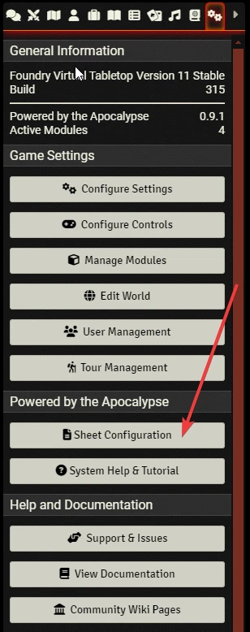
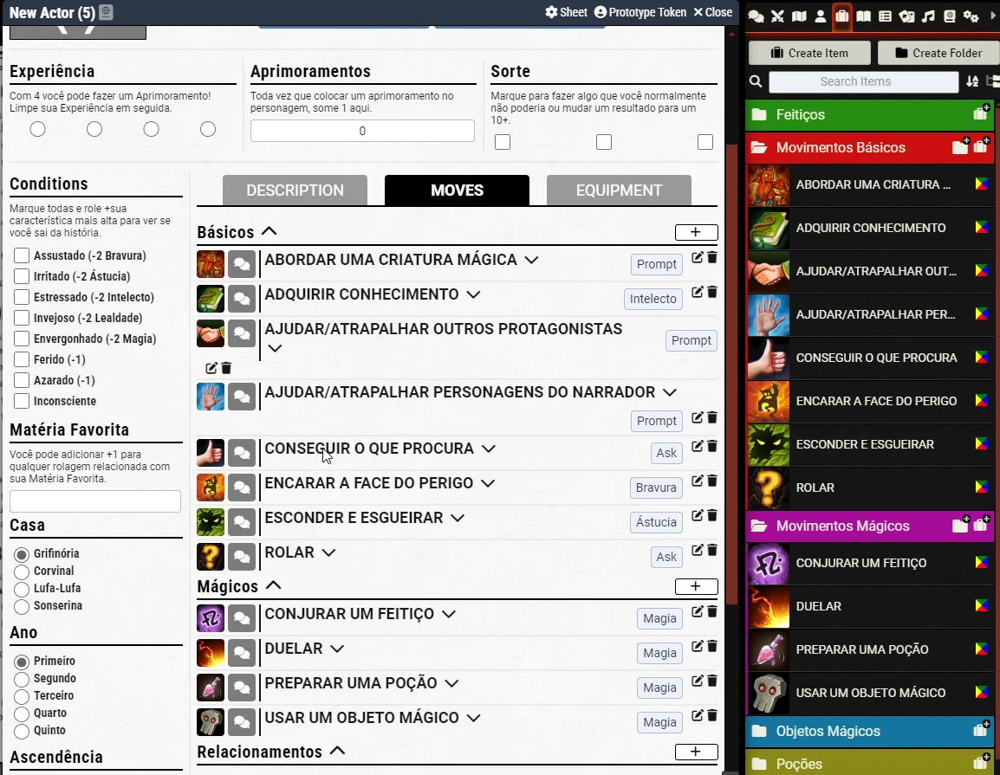

# Hogwarts RPG - Português do Brasil
Hogwarts RPG usa o sistema PBTA. Você deve ativar esse módulo no sistema PBTA e então carregar o modelo de ficha manualmente.

O modelo de ficha se encontra nesse [link](https://raw.githubusercontent.com/brunocalado/hogwarts-rpg-pbta-ptbr/main/templates/Hogwarts.txt). Copie e cole o texto em Sheet Configuration.

  

Depois disso vá nos compêndios e importe o compêndio de aventura Hogwarts RPG. Seu mundo será populado com movimentos, feitiços e mais do jogo.

  

Apenas arraste o que quer para a ficha. Você pode arrastar uma pasta e tudo dentro da pasta vai para a ficha.

Use as cenas importadadas para consulta rápida.

# License
The text is under Creative Commons BY-NC-SA 4.0 License. Check it out at: https://dbb-8.itch.io/hogwarts-rpg

Quadribol image: Dados Críticos:
- https://discord.com/channels/728447419632844811/728447419632844814/812070260299005952 
- https://www.youtube.com/channel/UClZr8ml8EIEK8W89renberQ
